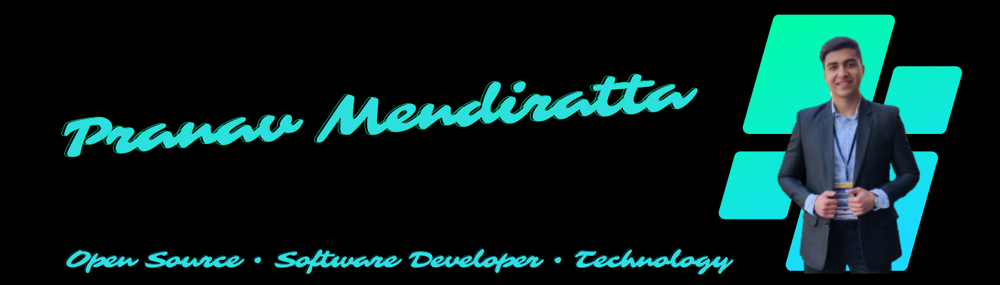

<h1 align="center">  Hello geeks! </h1>

#### I am Pranav, currently in my Junior year, pursuing a major in Computer Science. I am a tech head and am constantly trying to learn about new technologies everyday.

-   🌱 I’m currently working with React.js
-   👯 I’m looking to collaborate on [WordNook](https://github.com/ALPHAVIO/WordNook)
-   💬 Ask me about Technology and Sports
-   📫 How to reach me: <a href = "mailto: pranavmendi@gmail.com">Email</a>
-   😄 Pronouns: he/him
-   ⚡ Fun fact about me: I have played football at the state level and have also won multiple district championships.

  <h1>Connect With Me :inbox_tray: </h1>

     

  <!-- 
  
  
  
     -->

  <h1>Tech Skills :computer: </h1>

             

  <h1>GitHub Statistics :bar_chart: </h1>

  

 

<!-- 

  <h1>Open Source Work</h1>

  
  
  
  
  
  

- Open Source Mentor at [Winter of Code'21 by IIIT Kalyani](https://github.com/DSC-IIIT-Kalyani)
- Mentor and Project Administrator at [JGEC Winter of Code](https://github.com/JGEC-Winter-of-Code)
- Amongst top 5 contributors at [NJACK Winter of Code](https://github.com/NJACKWinterOfCode) by IIT Patna
- Mentor and Project Administrator at [Mexili Winter of Code](https://github.com/mexili/winter_of_code/blob/main/docs/mentors.md)
- Contributor at [TesseractCoding](https://github.com/TesseractCoding) under [Winter of Code](https://github.com/WinterOfCode) by Netaji Subhash Engineering College
- Mentor and Project Administrator at [GirlScript Summer of Code'21](https://gssoc.girlscript.tech/index.html#about)
- Mentee at [Script Winter of Code](https://swoc.tech/) by Script Foundation

 -->
