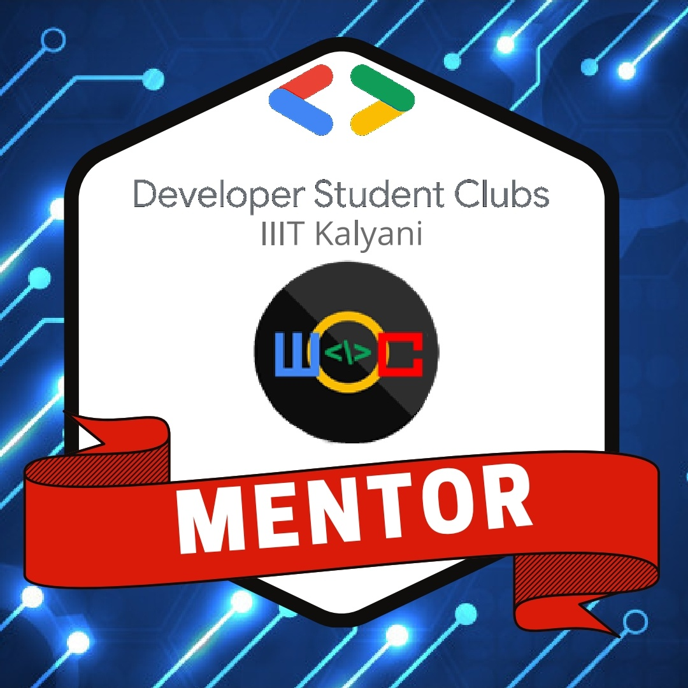
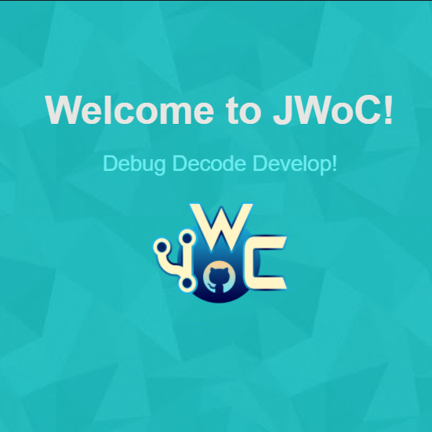

<h1>  Hello geeks! </h1>

#### I am Pranav, currently in my Junior year, pursuing a major in Computer Science. I am a tech head and am constantly trying to learn about new technologies everyday.

- 🌱 I’m currently working with ReactJs
- 👯 I’m looking to collaborate on BlogSite
- 💬 Ask me about Technology and Sports
- 📫 How to reach me: <a href = "mailto: pranavmendi@gmail.com">Email</a>
- 😄 Pronouns: he/him
- ⚡ Fun fact: There are more stars in the universe than grains of sand on all the beaches on Earth.

<h2>Open Source work- </h2>

- Open Source Mentor at [Winter of Code'21 by IIIT Kalyani](https://github.com/DSC-IIIT-Kalyani)
- Mentor and Project Administrator at [JGEC Winter of Code](https://github.com/JGEC-Winter-of-Code)
- Amongst top 5 contributors at [NJACK Winter of Code](https://github.com/NJACKWinterOfCode) by IIT Patna
- Mentor and Project Administrator at [Mexili Winter of Code](https://github.com/mexili/winter_of_code/blob/main/docs/mentors.md)
- Contributor at [TesseractCoding](https://github.com/TesseractCoding) under [Winter of Code](https://github.com/WinterOfCode) by Netaji Subhash Engineering College
- Mentee at [Script Winter of Code](https://swoc.tech/) by Script Foundation

